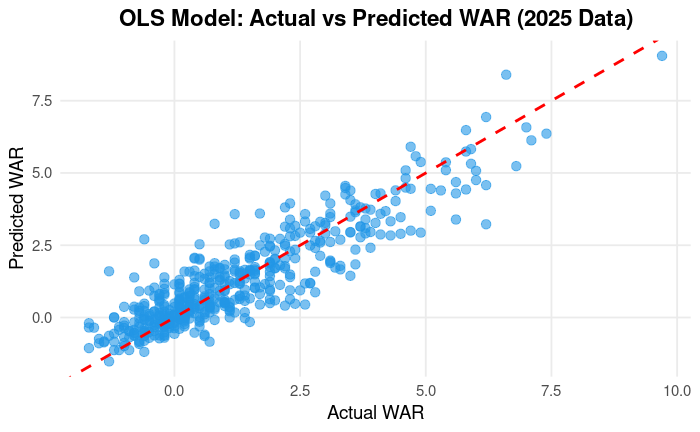
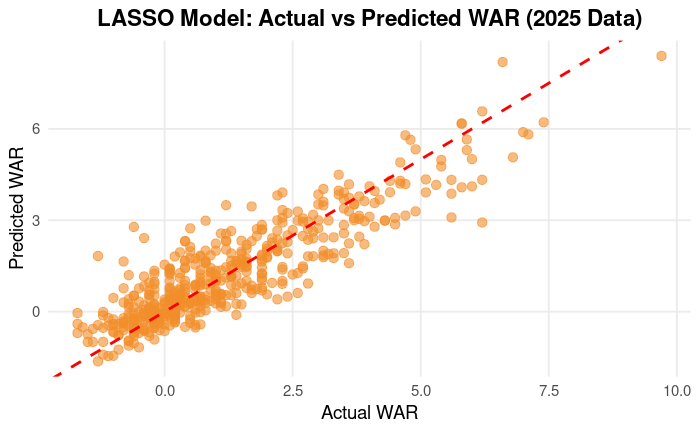
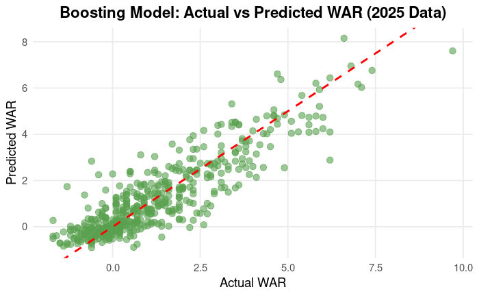

```{r setup, include=FALSE}
knitr::opts_chunk$set(echo=TRUE)
```
 
```{r}
library(knitr)
library(ggplot2)
```
 

## Introduction

 
## Motivation

	WAR plays a central role in how Major League Baseball teams evaluate player value, so the ability to accurately predict future WAR has meaningful practical implications. Teams frequently rely on WAR when making roster decisions, negotiating contracts, and allocating payroll. It is important to note that this data can be noisy when categorical or external factors influence a player’s value. That being said, WAR can fluctuate substantially from one season to another due to aging, position changes, or performance trends. Developing a model that predicts next-season WAR from current-season statistics can therefore provide teams with an analytical advantage by helping them anticipate changes in player value before they occur. Such predictions can assist in identifying declining players, support better-informed budgeting and contract planning, and encourage player development and roster optimization. 
Motivated by these considerations, this project applies statistical and machine learning techniques to evaluate whether a player’s current-season performance statistics can be used to predict their next season's WAR.

## Data 
 
	The data used in this study were obtained from Baseball-Reference, a recognized source for comprehensive Major League Baseball statistics. We compiled standard batting performance data for the 2020 through 2025 seasons, with approximately 500 player observations included for each year. To construct and evaluate the predictive models, data from the 2020-2024 seasons were used for training the models, and the 2025 season was reserved as a test set to evaluate predictive performance. The dataset includes a broad range of offensive performance variables, including WAR, age, measures of playing time, traditional batting statistics, and advanced offensive metrics. While WAR incorporates offensive, defensive, and positional components, this analysis focuses exclusively on offensive predictors to examine which batting performance variable best predicts the future WAR.
	
## OLS
 
To explore the relationship between current-season performance and future WAR, we implemented an Ordinary Least Squares (OLS) regression model. OLS identifies and quantifies the linear relationship between a response variable and a set of predictor variables by estimating coefficients that minimize the sum of squared errors. An OLS approach is straightforward, computationally efficient, and provides reliable estimates when the relationships between predictors and the response variable are approximately linear. However, OLS has some limitations, as it assumes linearity, independence, and normality of errors, which may struggle to hold well in real-world sports data, potentially limiting its predictive flexibility. 

	For our analysis, we evaluated model performance using error metrics on both the training data and the held-out 2025 season. The model identified several significant predictors of future WAR, including age, games played, plate appearances, at-bats, runs, hits, home runs, stolen bases, and OPS+. These results provide insight into which offensive performance metrics contribute most strongly to the prediction of a player’s subsequent WAR.
	
	The scatterplot comparing actual WAR to the predicted WAR for the OLS shows that the points are tightly clustered around the reference line, indicating a strong agreement between observed and predicted values. Compared to the LASSO and boosting models, the OLS model exhibits the strongest correlation between actual and predicted WAR, with predictions most closely aligning with the dotted line representing perfect prediction.


```{r ols_fun, echo=FALSE, fig.align="center", out.width="58%"}
knitr::include_graphics("Pictures/ols_fun.jpeg")
```

```{r ols-comp-plot, echo=FALSE, fig.align="center", out.width="90%"}
knitr::include_graphics("Pictures/final_ols_comp_plot.png")
```

```{r ols-comp-plot, echo=FALSE, fig.align="center", out.width="90%"}

```


## LASSO
 
LASSO stands for least absolute shrinkage and selection operator and is a popular model due to its feature selection abilities and prevention of overfitting. LASSO models perform L1 regularization, which shrinks some coefficients to exactly zero, removing them from the model entirely. It does this by adding a penalty term to the residual sum of squares which is then multiplied by a regularization parameter. The larger the regularization parameter, the larger the penalty, which shrinks more terms to zero. This type of feature selection makes LASSO models more interpretable than others since irrelevant or redundant predictors are removed, leaving the important ones. We wanted to include a feature selection model within our project for this reason, to see if any of our predictors were redundant or not necessary.

We built our LASSO model using a ten-fold cross-validation to select our regularization parameter and fit it on our training data set. This model yielded some interesting results when compared to the OLS and boosting models. The features that were shrunk were plate appearances, home runs, RBIs, batting average, on-base percentage, OPS+, and rOBA. These shrunken parameters were intriguing to us because they are all very important offensive statistics, which we assumed would be integral to predicting WAR. This resulted in a testing MAE of 0.647, testing RMSE of 0.852, and $R^2$ of 78.4%, which are better than our boosting model but worse than OLS. These metrics suggest that the LASSO model is a solid choice when predicting WAR, since the RMSE of 0.852 infers that our predictions would be within .8-.9 of the player's actual WAR. Given that it also performs feature selection, this model is highly competitive with OLS and boosting. 

```{r boost-comp-plot, echo=FALSE, fig.align="center", out.width="90%"}
knitr::include_graphics("Pictures/LASSO_comp_plot.png")
```
```{r boost-comp-plot, echo=FALSE, fig.align="center", out.width="90%"}

```

Note: zero was not included in the initial cross validation coding for selecting the penalty parameter. When redone with zero included, it was chosen as the best penalty and the test metrics were extremely similar to OLS. 


## Boosting

To evaluate whether a more flexible, non-linear model could improve the prediction of next season WAR, we implemented a gradient boosting regression model using the tidymodels framework. Boosting builds many decision trees sequentially, where each new tree is trained to reduce the errors made by the previous trees. Unlike OLS and LASSO, boosting does not assume linear relationship between predictors and WAR and can naturally capture non linear effects and interactions among offensive statistics.

In our code, we fit a boosted tree model with 500 trees and tuned key hyperparameters that control model complexity and learning behavior: tree depth, learning rate and minimum node size (min_n). We used 10-fold cross-validation on the training data and a random hyperparameter grid, choosing the final configuration that minimized cross-validated RMSE. After selecting the best model, we refit the boosted tree workflow on the full training set and we generated predictions for both the internal test split and the held-out 2025 season, evaluating performance using ME, RMSE, and R2.

The boosting model achieved relatively low error on the training data (RMSE = 0.669, MAE = 0.494) and modestly higher error on the validation test set (RMSE = 0.730, MAE = 0.537). However, predictive performance deteriorated more noticeably on the 2025 data, where the RMSE increased to 0.870, and the MAE rose to 0.657. This gap between training and future-season error suggests that the boosted model may be overfitting patterns present in the historical data that do not generalize as well to new seasons.

```{r boost-comp-plot, echo=FALSE, fig.align="center", out.width="90%"}
knitr::include_graphics("Pictures/boost_comp_plot.png")
```
```{r boost-comp-plot, echo=FALSE, fig.align="center", out.width="90%"}

```
Overall, the boosting model did not outperform the linear approaches on the 2025 test set. While Boosting offers greater flexibility, it can be less advantageous in the predictors. In our case, WAR is influenced not only by offense but also by defensive value, positional adjustments, and external factors such as injuries and playing time changes. Since our predictors were limited to offensive stats, the boosted model likely learned some nonlinear patterns in the training data that did not generalize as effectively. Additionally, boosting models are inherently less interpretable than OLS or LASSO, it relies on a large collection of trees, making it harder to clearly describe the marginal impact of a single statistic on predicted WAR


## Player Examples
	To see some tangible predictions for our OLS model, we chose five players to see how well the model performed. The players were Aaron Judge, the reigning AL MVP, Hunter Goodman, an All-Star on the Colorado Rockies, Michael Toglia, a player tied for the worst WAR in the data set, Bobby Witt Jr., a superstar offensive and defensive player, and Shohei Ohtani, the reigning NL MVP. Our predictions for the first four players mentioned were quite good, with the residuals ranging from .5 to 1. The exception came with Shohei Ohtani, whose prediction was 1.8 points higher than his actual WAR. This could be an example of the OLS model performing poorly with significant outliers due to Ohtani’s batting statistics being some of the best in the league for 2025. Since our model was trained on batting statistics alone, it predicted a significantly higher WAR than he actually had. In a similar vein, the model predicted Bobby Witt Jr.’s WAR to be one point less than it was. An explanation for this could be due to Bobby Witt Jr. being an excellent defensive player, shown by his winning the Platinum Glove Award in 2025, which is given to the league's best defenders that year. Since our model did not incorporate defensive statistics, it predicted a lower WAR for Witt Jr.. These limitations give insight to how we could tweak our model to be more accurate in the future, mainly by including defensive metrics and giving significant hitting outliers less weight.
	
```{r boost-comp-plot, echo=FALSE, fig.align="center", out.width="90%"}
knitr::include_graphics("Pictures/war_examples.png")
```

 
## Key Findings 

Among the models evaluated, the Ordinary Least Squares (OLS) regression demonstrated the strongest overall performance, achieving the lowest prediction error and the highest explained variance. While the LASSO model did not outperform OLS in terms of predictive accuracy, it proved valuable for variable selection by identifying a smaller subset of meaningful predictors, thereby enhancing interpretability and highlighting which player statistics most strongly influence future WAR. Across models, plate appearances, home runs, hits, OPS+, walks, and strikeouts consistently exhibited strong predictive value. Although OLS is viewed as a sub-case of LASSO, it outperformed in this context primarily because many offensive variables contribute incrementally to WAR, and OLS is able to retain and estimate all of these effects without shrinking coefficients to zero.

	Despite these results, accurately predicting WAR remains inherently challenging, as several components of WAR are not fully captured by batting statistics alone. Additionally, external factors such as injuries, changes in playing time, and other unobserved influences introduce variability that contributes to noise within the data and uncertainty in predictions. 
