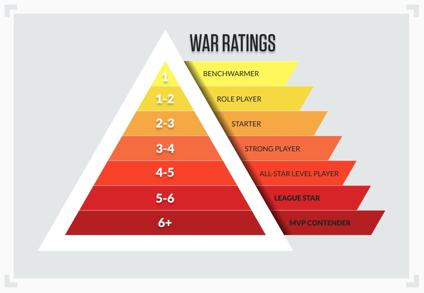

\vspace{0.5cm}

<div class="columns">
<div class="column">

- Goal: build a model to predict WAR (Wins Above Replacement)
- WAR measures a player’s total contribution compared to a replacement-level player
- Interpreted as the number of additional wins a player adds to a team

</div>
<div class="column">



</div>
</div>

## Models used 

\vspace{0.5cm}

<div class="columns">
<div class="column" width = "33.3%">

- OLS
  - Simplest model used
  
</div>
<div class="column" width = "33.3%">

- LASSO
  - Feature selection

</div>
<div class="column" width = "33.3%">

- Boosting
  - Tree based method
  
</div>
</div>


## OLS Models

\vspace{0.5cm}

- OLS identifies and measures the relationship between a response variable and predictor variables.
- Finds a best-fitting line through a set of data points
- Pros: Convenient, accurate regression results for linearly related data
- Cons: May be too simplistic for real world examples, assumptions of Linear Regression

## OLS Metrics Plot

\vspace{0.5cm}

- 

## LASSO Models

\vspace{0.5cm}

- LASSO models perform regularization (L1), which shrinks some coefficients to exactly zero 
  - Essentially feature selection 
- Pros: Produces a more interpretative model, prevents over fitting
- Cons: 

## LASSO metrics plot

\vspace{0.5cm}

<div class="columns">
<div class="column" width = "40%">

- Metrics ran on split training data
- Good performance?

</div>
<div class="column" width = "60%">

```{r echo=FALSE}
library(ggplot2)

lasso_plot_pres <- data.frame(metrics = c("RMSE", "MAE"), values = c(0.7329, 0.5594))

LASSO_plot <- lasso_plot_pres |>
  ggplot(aes(x = metrics, y = values)) +
  geom_col(fill = "blue") +
  theme_bw() +
  geom_text(aes(label = round(values, digits = 4)), color =  "white", vjust = 5) +
  labs( x = "Metrics", y = "Values", title = "Test MAE and RMSE for LASSO Model ")

LASSO_plot
```


</div>
</div>

## Boosting Models 

\vspace{0.5cm}

- Boosting grows trees sequentially using information from previously grown trees
  - Each tree fit on a modified version of the original data set 

## Boosting metrics plot

\vspace{0.5cm}


<div class="columns">
<div class="column" width = "40%">

- Metrics ran on split training data

</div>
<div class="column" width = "60%">

```{r echo = FALSE}
library(ggplot2)

boost_plot_pres <- data.frame(metrics = c("RMSE", "MAE"), values = c(0.7301, 0.537))

BOOST_plot <- boost_plot_pres |>
  ggplot(aes(x = metrics, y = values)) +
  geom_col(fill = "orange") +
  theme_bw() +
  geom_text(aes(label = round(values, digits = 4)), color =  "white", vjust = 5) +
  labs( x = "Metrics", y = "Values", title = "Test MAE and RMSE for Boosting Model ")

BOOST_plot
```


</div>
</div>


## Model Comparison: OLS, LASSO, and Boosting

```{r compare-plots, echo=FALSE, fig.align="center", out.width="33%"}
knitr::include_graphics(c(
  "Pictures/OLS Model Actual vs Predicted.png",
  "Pictures/Lasso Actual vs Predicted 2025.png",
  "Pictures/Boosting Actual vs Predicted 2025.png"
))
```
