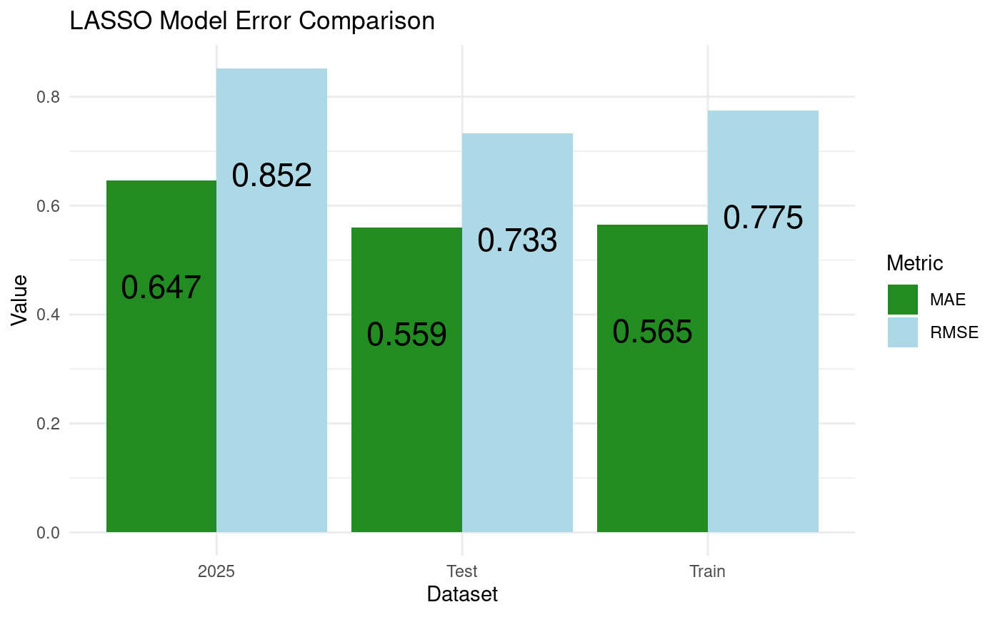
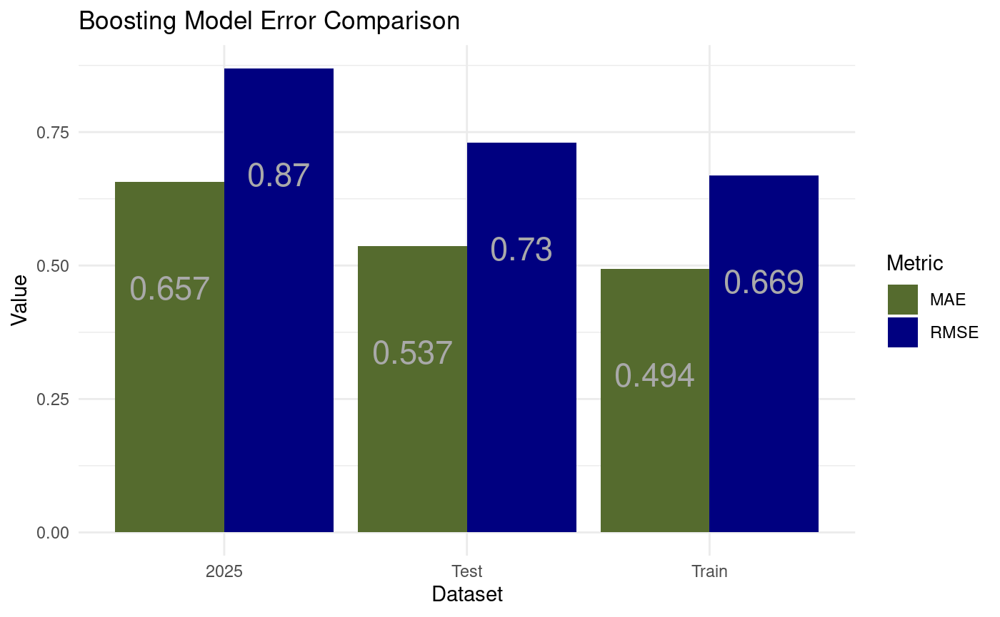
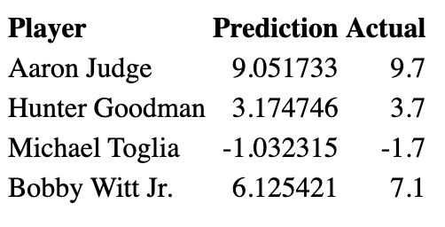

## Overview


\vspace{0.5cm}

<div class="columns">
<div class="column">

- Goal: build a model to predict WAR (Wins Above Replacement)
- WAR measures a player’s total contribution compared to a replacement-level player
- Interpreted as the number of additional wins a player adds to a team

</div>
<div class="column">


</div>
</div>

## Data used 

\vspace{0.7em}

- Our data came from baseball-reference.com

- We used standard batting data from 2020-2025 to built our model (500 obs each year)
  - 2020-2024 was used for training
  - 2025 was out test data set 
  
- Variables: 
  - WAR, games played, plate appearances, at bats, runs scored, hits, doubles, triples, home runs, RBIs, stolen bases, caught stealing, walks, strike outs, batting average, on base percentage, slugging percentage, OPS percentage, OPS+, rOBA, 
Rbat+, total bases, double plays grounded into, hit by pitch, sacrifice hits, sacrfice flies, intentional walks


## Models used 

\vspace{0.5cm}

<div class="columns">
<div class="column" width = "33.3%">

- OLS
  - Simplest model used
  
</div>
<div class="column" width = "33.3%">

- LASSO
  - Feature selection

</div>
<div class="column" width = "33.3%">

- Boosting
  - Tree based method
  
</div>
</div>


## OLS Models

\vspace{0.5cm}

- OLS identifies and measures the relationship between a response variable and predictor variables.

- Finds a best-fitting line through a set of data points

- Pros: Convenient, accurate regression results for linearly related data

- Cons: May be too simplistic for real world examples, assumptions of Linear Regression

## OLS Metrics Plot

\vspace{0.5cm}


## LASSO Models

\vspace{0.5cm}

- LASSO models perform regularization (L1), which shrinks some coefficients to exactly zero 

  - Essentially feature selection 
  
- Pros: Produces a more interpretative model, prevents over fitting

- Cons: LASSO performs poorly when predictors are highly correlated

## LASSO metrics plot

\vspace{0.5cm}

<div class="columns">
<div class="column" width = "40%">

- Metrics ran on split training data
- Shrunk terms:
  - Plate appearances, home runs, RBIs, batting average, on base percentage, OPS+, rOBA
  

</div>
<div class="column" width = "60%">

```{r lasso-comp-plot, echo=FALSE, fig.align="center", out.width="90%"}

```


</div>
</div>

## Boosting Models 

\vspace{0.5cm}

- Boosting grows trees sequentially using information from previously grown trees  

  - Each tree fit on a modified version of the original data set  

\vspace{0.4cm}

- Pros: High predictive accuracy and captures complex, nonlinear relationships automatically.

- Cons: Prone to overfitting and requires careful tuning of hyperparameters to perform well.

## Boosting metrics plot

\vspace{0.5cm}


<div class="columns">
<div class="column" width = "40%">

- Metrics ran on split training data

</div>
<div class="column" width = "60%">

```{r boost-comp-plot, echo=FALSE, fig.align="center", out.width="90%"}

```


</div>
</div>


## Model Comparison: OLS, LASSO, and Boosting

```{r compare-plots, echo=FALSE, fig.align="center", out.width="33%"}
knitr::include_graphics(c(
  "Pictures/OLS Model Actual vs Predicted.png",
  "Pictures/Lasso Actual vs Predicted 2025.png",
  "Pictures/Boosting Actual vs Predicted 2025.png"
))
```

</div>
</div>


## Model Comparison: RMSE, MAE, and R²

\centering

\includegraphics[height=0.23\textheight]{Pictures/Model_Comparison_RMSE_cropped.png}

\vspace{0.7em}

\includegraphics[height=0.23\textheight]{Pictures/Model_Comparison_MAE_cropped.png}

\vspace{0.7em}

\includegraphics[height=0.23\textheight]{Pictures/Model_Comparison_R2_cropped.png}

## Player Examples

\vspace{0.7em}



