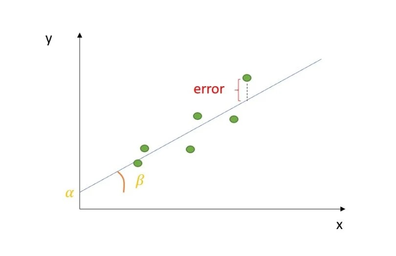
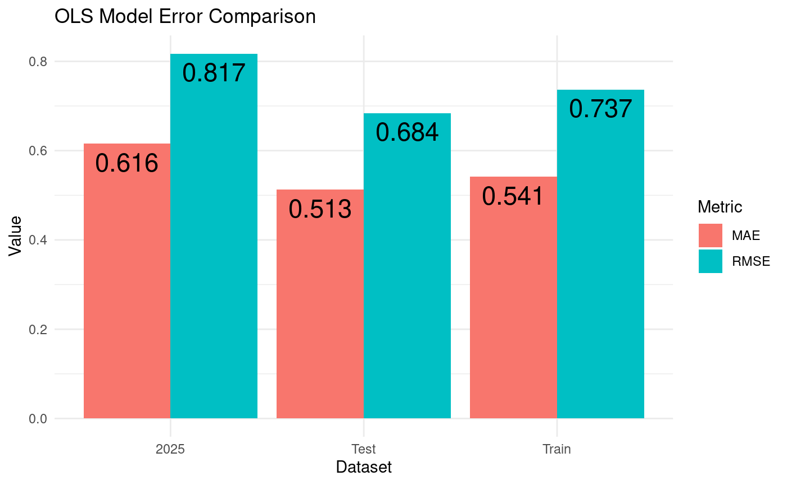
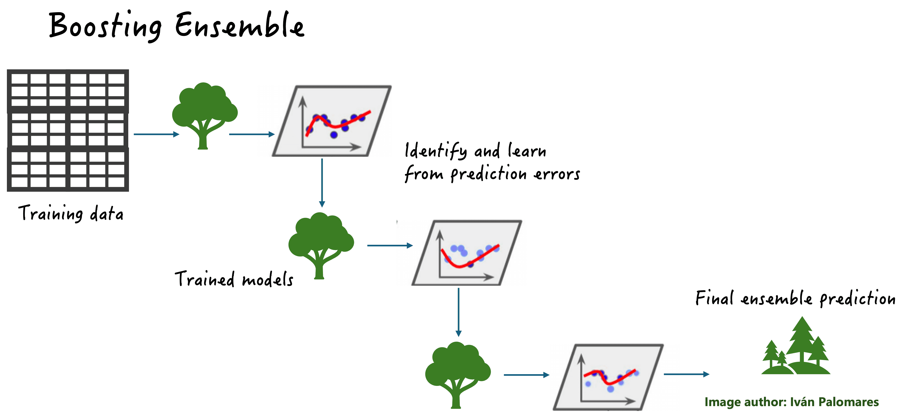
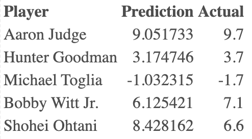

## Overview


<div class="rows">
<div class="row">

- Goal: build a model to predict WAR (Wins Above Replacement)
- WAR measures a player’s total contribution compared to a replacement-level player
  - It combines multiple aspects of performance: hitting, base running, defensive value, positional difficulty, and their playing time, and puts it into a single number.
  - Interpreted as the number of additional wins a player adds to a team
  - Since it provides a single encompassing measure of a player's value, WAR is greatly relied on by MLB front offices

</div>
<div class="row" style="text-align: center;">


</div>
</div>


## Motivation


- Can a player's current-season performance statistics be used to predict their next season Wins Above Replacement (WAR)?

- Major League Baseball teams rely heavily on WAR to evaluate a players value, make contract decisions, and project roster needs. 
- It provide a competitive advantage for a team by:
  - Helps identify declining players
  - Allows for budgeting and contract planning
  - Encourages player development and roster optimization 
  

- Our goal is, by using statistical and machine learning models, we will:
  - Identify which player statistics best predict future WAR
  - Compare the performance of three different statistical learning models: OLS, LASSO, and BOOSTING
  - Build a model that maintains high predictive accuracy


## Data used 

\vspace{0.7em}

- Our data came from baseball-reference.com

- We used standard batting data from 2020-2025 to build our models (500 obs each year)
  - 2020-2024 was used for training
  - 2025 was our test data set 
  
- Variables: 
  - WAR, age, **games played**, plate appearances, at bats, runs scored, **hits**, doubles, triples, **home runs**, RBIs, stolen bases, caught stealing, walks, strikeouts, **batting average**, on base percentage, slugging percentage, OPS percentage, OPS+, rOBA, 
Rbat+, total bases, double plays grounded into, hit by pitch, sacrifice hits, sacrifice flies, intentional walks


##
\vspace*{\fill}

\begin{center}
{\color{structure} \bfseries \fontsize{36}{40}\selectfont Models Used}
\end{center}

\vspace*{\fill}

```{r baseball-player-1, echo=FALSE, fig.align="center", out.width="90%"}
knitr::include_graphics("Pictures/baseball_player.jpeg")
```

<!--
## Models Used 


- OLS
  - Baseline linear model
  - Benchmark for comparing models
  


-->

## OLS Models

<div class="rows">
<div class="row">

- An Ordinary Least Squares (OLS) model identifies and measures the relationship between a response variable and predictor variables
  - It finds the best-fitting linear trend that minimizes squared error. 

- Pros:
  - Convenient
  - Has accurate regression results for linearly related data

- Cons: 
  - May be too simplistic for real world examples
  - Assumptions of Linear Regression

</div>
<div class="row" style="text-align: center;">


```{r ols_fun, echo=FALSE, fig.align="center", out.width="58%"}

```


</div>
</div>


## OLS Metrics Plot

\vspace{0.5cm}

<div class="columns">
<div class="column" width = "40%">

- Error metrics for both final testing data set (2025) and the training data split into training and testing sets
- Significant terms:
  - age, games played, plate appearances, at bats, runs, hits, doubles, triples, home runs, stolen bases, caught stealing,
  walks, strikeouts, OPS+

</div>
<div class="column" width = "60%">

```{r ols-comp-plot, echo=FALSE, fig.align="center", out.width="90%"}

```
</div>
</div>

## LASSO Models

\vspace{0.5cm}

<div class="rows">
<div class="row">

- LASSO models perform regularization (L1), which shrinks some coefficients to exactly zero 

  - Essentially feature selection 
  
- Pros: Produces a more interpretative model, prevents over fitting

- Cons: LASSO performs poorly when predictors are highly correlated

</div>
<div class="row" style="text-align: center;">

```{r lasso_fun, echo=FALSE, fig.align="center", out.width="58%"}
knitr::include_graphics("Pictures/lasso_fun.png")
```

</div>
</div>

## LASSO Metrics Plot

\vspace{0.5cm}

<div class="columns">
<div class="column" width = "40%">

- Error metrics for both final testing data set (2025) and the training data split into training and testing sets
- Shrunk terms:
  - Plate appearances, home runs, RBIs, batting average, on base percentage, OPS+, rOBA
  

</div>
<div class="column" width = "60%">

```{r lasso-comp-plot, echo=FALSE, fig.align="center", out.width="90%"}
knitr::include_graphics("Pictures/LASSO_comp_plot.png")
```


</div>
</div>

## Boosting Models 

\vspace{0.3cm}

<div class="rows">
<div class="row">

- Boosting grows trees sequentially using information from previously grown trees  

  - Each tree fit on a modified version of the original data set
  - Good at capturing non-linear patterns

- Pros: High predictive accuracy and captures complex, nonlinear relationships automatically.

- Cons: Prone to over fitting and requires careful tuning of hyper parameters to perform well.

</div>
<div class="row" style="text-align: center;">

```{r boosting_fun, echo=FALSE, fig.align="center", out.width="58%"}

```

</div>
</div>

## Boosting Metrics Plot

\vspace{0.5cm}


<div class="columns">
<div class="column" width = "40%">

- Error metrics for both final testing data set (2025) and the training data split into training and testing sets

</div>
<div class="column" width = "60%">

```{r boost-comp-plot, echo=FALSE, fig.align="center", out.width="90%"}
knitr::include_graphics("Pictures/boost_comp_plot.png")
```


</div>
</div>


## Model Comparison: OLS, LASSO, and Boosting

```{r compare-plots, echo=FALSE, fig.align="center", out.width="33%"}
knitr::include_graphics(c(
  "Pictures/OLS Model Actual vs Predicted.png",
  "Pictures/Lasso Actual vs Predicted 2025.png",
  "Pictures/Boosting Actual vs Predicted 2025.png"
))
```

</div>


## Model Comparison: RMSE, MAE, and R²

\centering

\includegraphics[height=0.23\textheight]{Pictures/Model_Comparison_RMSE_cropped.png}

\vspace{0.7em}

\includegraphics[height=0.23\textheight]{Pictures/Model_Comparison_MAE_cropped.png}

\vspace{0.7em}

\includegraphics[height=0.23\textheight]{Pictures/Model_Comparison_R2_cropped.png}

## Player Examples Using OLS model

\vspace{0.10cm}



## Key Findings
\vspace{0.5cm}

- OLS performed the best overall
  - Lowest prediction error
  - Highest explained variance
- LASSO selected a subset of meaningful predictors, making it easier to understand which player stats drive WAR
- Variables with a strong predictive value: plate appearances, home runs, hits, OPS+, walks, and strikouts
- WAR prediction is challenging
  - some components are hard to obtain from batting-only statistics
  - player injuries, playing time, or other external factors produce noise


## Questions?
