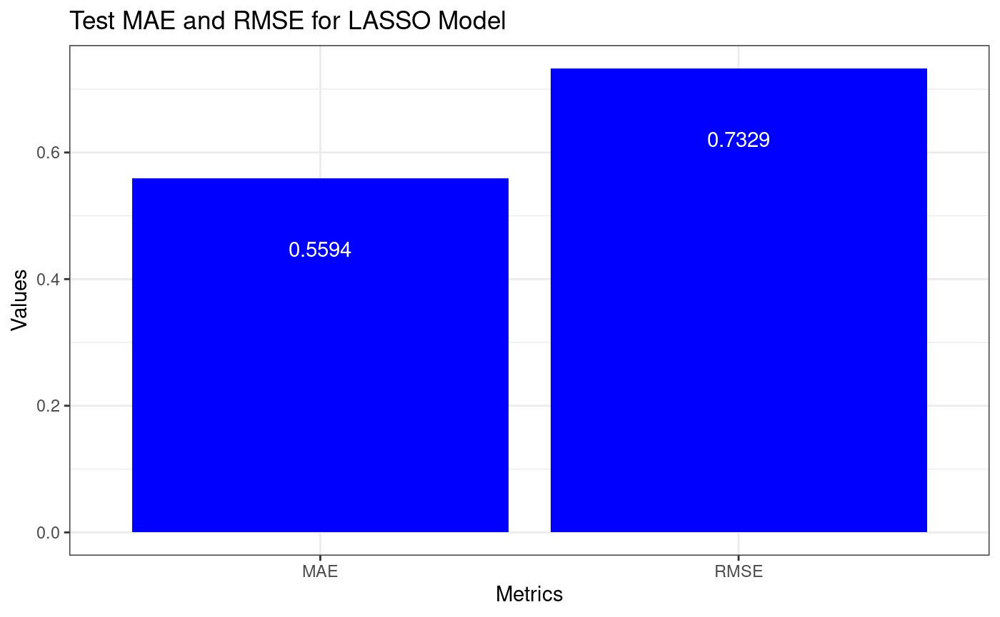

```{r setup, include=FALSE}
knitr::opts_chunk$set(echo = FALSE)
```

## Overview

<div class="columns">
<div class="column">

- Goal: build a model to predict WAR (Wins Above Replacement)
- WAR measures a player’s total contribution compared to a replacement-level player
- Interpreted as the number of additional wins a player adds to a team

</div>
<div class="column">


</div>
</div>

---
## LASSO metrics plot

<div class="columns">
<div class="column">

- We love R

</div>
<div class="column">



</div>
</div>


## Predicting WAR 