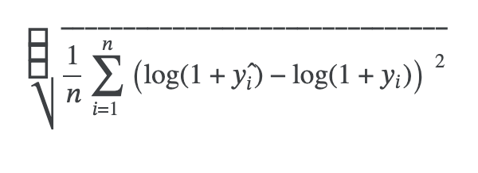
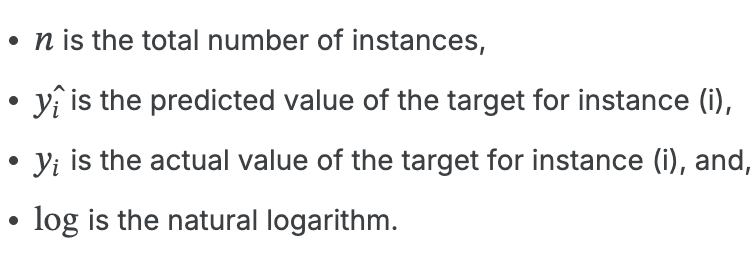

```{r}
library(ggplot2)
library(dplyr)
library(tidyr)
library(lubridate)
library(forecast)
library(readr)
```

## Chosen Problem

-   "Store Sales - Time Series Forecasting" From Kaggle

-   Goal: Test the capability of different models to accurately forecast store sales based on past yearly data.

-   Evaluation Metric for Competition: Root Mean Squared Logarithmic Error

    {width="213" height="76"}{width="231"}

-   Competition Link: <https://www.kaggle.com/competitions/store-sales-time-series-forecasting>

## Description of Data

-   Given Files: 1 train, 1 test, 4 additional datasets

    -   `train.csv`, `test.csv`
    -   `stores.csv`
    -   `oil.csv`
    -   `transactions.csv`
    -   `holidays_events.csv`

-   Training Data: 3,000,888 rows, 16 columns (prior to cleaning & transformations)

-   **Target Feature**: `sales`

## Time Series Considerations

-   **Lag Variable**: Represents the value from a previous point in time
    -   Captures time dependencies and relationships to past observations
-   Engineered 7 lag features for `sales`: 1, 7, 30, 60, 90, 180, 365 days

## Initial Data Analysis

```{r}
train <- read_csv("Data/final_train.csv")
oil <- read_csv("Data/Unprocessed/oil.csv")

train <- train %>%
  filter(!(date %in% as.Date(c("2013-01-01", "2014-01-01", "2015-01-01", "2016-01-01", "2017-01-01"))))

sales_by_year <- train %>%
  mutate(date = as.Date(date)) %>%
  group_by(date) %>%
  summarise(total_sales = sum(sales)) %>%
  mutate(year = format(date, "%Y"))
  
graph_1 <- ggplot(sales_by_year, aes(x = date, y = total_sales, color = year)) +
  geom_line() +
  labs(
    title = "Store Sales Over Time By Year",
    x = "Date",
    y = "Total Sales",
    color = "Year"
  ) +
  theme_minimal()

graph_1
```

# 

```{r}
train <- train %>%
  mutate(date = as.Date(date))

oil <- oil %>%
  mutate(date = as.Date(date))

sales_oil_data <- train %>%
  group_by(date) %>%
  summarise(total_sales = sum(sales)) %>%
  left_join(oil, by = "date") %>%
  rename(oil_price = dcoilwtico)
  
graph_2 <- ggplot(sales_oil_data, aes(x = date)) +
  geom_line(aes(y = total_sales, color = "Sales")) +
  geom_line(aes(y = oil_price * 1000, color = "Oil Price (Scaled")) +
  scale_y_continuous(
    name = "Total Sales",
    sec.axis = sec_axis(~ . / 1000, name = "Oil Price")
  ) +
  scale_color_manual(
    name = "Legend",
    values = c("Sales" = "blue", "Oil Price (Scaled)" = "red")
  ) +
  labs(
    title = "Store Sales Over Time with Oil Price Overlay",
    x = "Date"
  ) +
  theme_minimal()

graph_2
```

---

```{r}

# Correlation Heat Map


```

## Autoregressive Integrated Moving Average (ARIMA) Model

-   Reasoning:

    -   Model is specifically used for time series data

    -   Could potentially identify more granular patterns within specific time periods

-   Able to use lagged values of variables to better quantify autocorrelation within the data set

-   Autocorrelation: "The degree of correlation of the same variables between two successive time intervals"

------------------------------------------------------------------------

### ARIMA Base Parameters

-   Base Function Parameters (5,1,1):
    -   5 - Number of past observations that are used to predict the current value

    -   1 - Number of times the current value is subtracted from previous value

        -   Ensures Stationary Data

    -   1 - Number of lagged forecast errors used to predict current value

        -   Uses most recent forecast error to adjust prediction

------------------------------------------------------------------------

### ARIMA Seasonal Parameters

-   Seasonal Function Parameters (2,1,2) and Frequency Term (7):

    -   7 - Number of days the seasonal parameters use when predicting

    -   2 - Number of past observations used to predict current value (7, 14 days prior)

    -   1 - Number of times current value is subtracted from value 7 days prior

    -   2 - Number of lagged forecast errors used to predict current values (7, 14 days prior)

------------------------------------------------------------------------

## Results

```{r}

models <- data.frame("ARIMA", "Lasso", "")
combined_rmsle <- data.frame()
combined_ranking <- data.frame()


```
